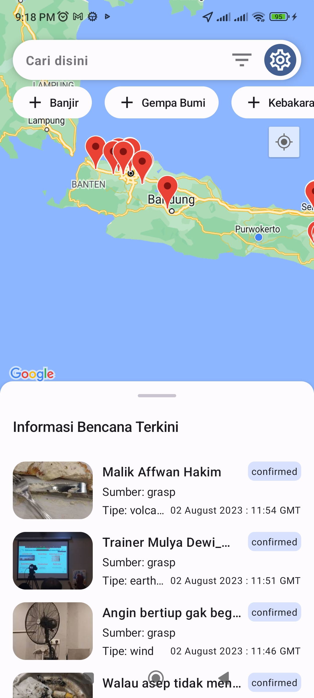
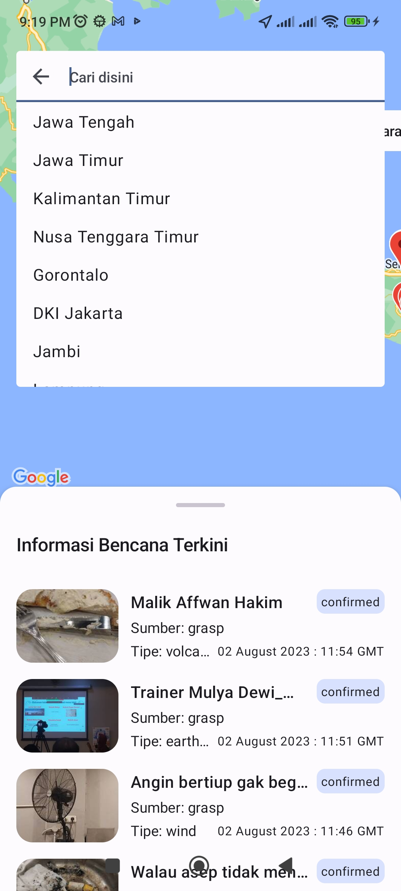
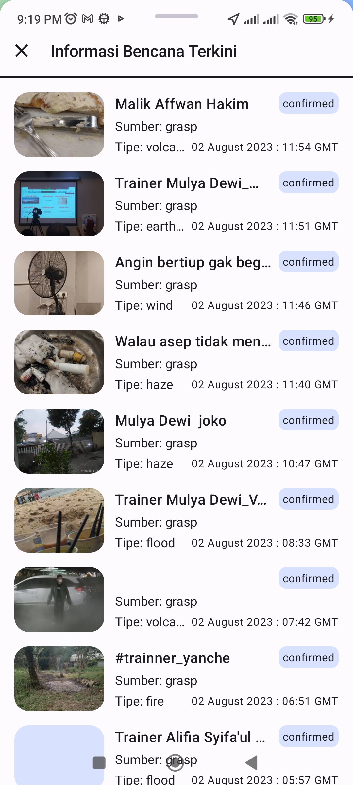
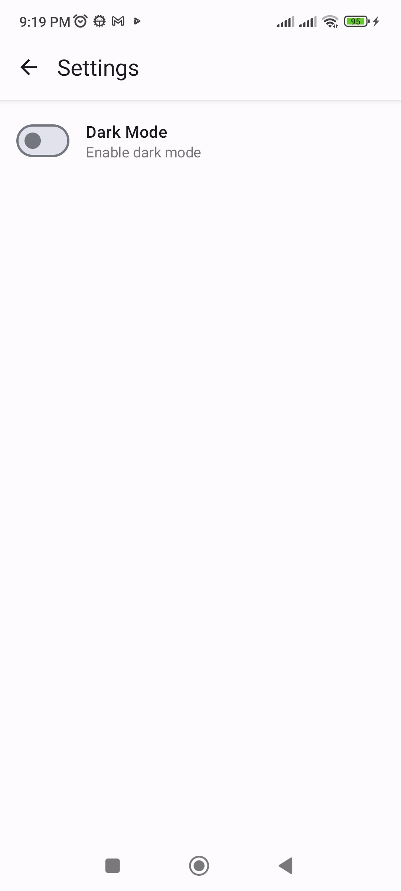

# ME14-BencanaApp-GG3MEGP0532-Abdul-Hafiz-Ramadan

[Link Drive](https://drive.google.com/drive/folders/1JhQ4RRwpDWOU9OntBxUVBIXl1_x6RTMk?usp=sharing)

[Demo Youtube](https://youtu.be/FxQjLFvwWzk)

## Introduction

Halo semua nya perkenalkan saya `Abdul Hafiz Ramadan` dengan id `GG3MEGP0532`, peserta generasi GIGIH 3.0 dengan learning track mobile engineer, kelas ME 14. Disini saya mempresentasikan aplikasi BencanaApp yang merupakan final task dari generasi  gigih 3.0.

## BencanaApp
Disaster Map adalah aplikasi yang membantu pengguna untuk mengawasi berbagai bencana alam yang terjadi di Indonesia, seperti banjir, gempa bumi, kebakaran, kabut asap, angin kencang, dan aktivitas gunung berapi. Aplikasi ini menawarkan informasi real-time tentang bencana-bencana tersebut, sehingga pengguna dapat mengetahui data terkini. Selain itu, aplikasi ini juga memiliki preferensi notifikasi. Jika preferensi notifikasi diaktifkan, pengguna akan mendapatkan notifikasi tepat waktu tentang daerah yang terdampak banjir di Jakarta, dengan menyajikan status banjir secara real-time.

## Features
Aplikasi bencana app memiliki fitur utama:
 - Menampilkan daftar bencana dalam periode waktu tertentu ✅
 - Memfilter bencana seperti :(banjir, gempa bumi, kebakaran, kabut asap, gunung berapi, dll) ✅
 - Memfilter bencana berdasarkan area ✅
 - Menampilkan bencana di dalam peta ✅
 - Notifikasi berdasarkan ketinggian air ✅
 - Mendukung tema terang/gelap ✅
 - Mendukung animasi loading ✅
 - Offline mode support ✅


## Dependencies
Aplikasi bencapa app dibangun menggunakan: 
| Nama | Versi |
|--|--|
| [Kotlin](https://kotlinlang.org/) | 1.7.20 |
| [Compose BOM](https://developer.android.com/jetpack/compose/bom) | 2022.10.00 |
| [Hilt](https://developer.android.com/training/dependency-injection/hilt-android) | 2.44 |
| [Material Design 2](https://developer.android.com/jetpack/compose/designsystems/material) | 2 |
| [Material Design 3](https://developer.android.com/jetpack/compose/designsystems/material3) | 3 |
| [Compose Destinations](https://github.com/raamcosta/compose-destinations) | 1.7.41-beta |
| [Google Maps SDK for Compose](https://developers.google.com/maps/documentation/android-sdk/maps-compose) | 2.11.5 |
| [Accompanist Permissions](https://google.github.io/accompanist/permissions/) | 0.31.5-beta |
| [Datastore Preferences](https://developer.android.com/jetpack/androidx/releases/datastore) | 1.0.0 |
| [Room](https://developer.android.com/jetpack/androidx/releases/room) | 2.5.2 |
| [Compose Shimmer](https://github.com/valentinilk/compose-shimmer) | 1.0.5 |
| [desugar_jdk_libs_nio](https://android-developers.googleblog.com/2023/02/api-desugaring-supporting-android-13-and-java-nio.html) | 2.0.2 |
| [Retrofit 2](https://square.github.io/retrofit/) | 2.9.0 |
| [Gson](https://search.maven.org/artifact/com.squareup.retrofit2/converter-gson/2.9.0/jar) | 2.9.0 |
| [Workmanager](https://developer.android.com/jetpack/androidx/releases/work#declaring_dependencies) | 2.8.1 |
| [Lottie Compose](https://github.com/airbnb/lottie/blob/master/android-compose.md) | 6.1.0 |
| [Sheets Compose Dialogs](https://github.com/maxkeppeler/sheets-compose-dialogs/) | 1.2.0 |
| [Mockito Core](https://mvnrepository.com/artifact/org.mockito/mockito-core) | 5.4.0 |
| [Mockito Inline](https://mvnrepository.com/artifact/org.mockito/mockito-inline) | 5.2.0 |
| [Kotlinx Coroutines Test](https://github.com/Kotlin/kotlinx.coroutines/tree/master/kotlinx-coroutines-test) | 1.7.3 |
| [Turbine](https://github.com/cashapp/turbine) | 1.0.0 |
| [Chucker](https://github.com/ChuckerTeam/chucker) | 4.0.0 |

# Getting Started

## Prerequisites
- Android Studio Giraffe | 2022.3.1 Canary 11
- MinSdk 24

## Clone Project
Untuk memulai proyek, kloning proyek menggunakan perintah berikut:
```
git clone https://github.com/GG-3-0-Mobile-Engineering/ME14-BencanaApp-GG3MEGP0532-Abdul-Hafiz-Ramadan.git
```

## Set Up Google Maps API Key
Sebelum menjalankan aplikasi, Anda perlu mendapatkan Google Maps API Key dari [sini](https://developers.google.com/maps/documentation/android-sdk/get-api-key). 
Tambahkan Kunci Google Maps API dan URL Peta Bencana API ke file local.properties di proyek.
```
MAPS_API_KEY={ADD_YOUR_API_KEY}
```

## Screenshots
      
